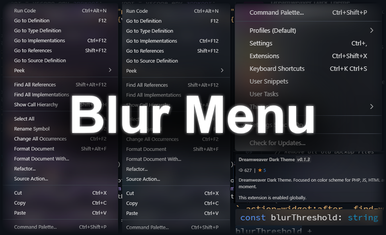

# Blur Menu Extension

Enhance your UI experience by applying a blur effect to the menu with this extension.

## Usage Instructions

### Installation Steps
1. Activate the command palette using `Ctrl + Shift + P`.
2. Type "Blur Menu - Enable" and select it.
3. Input the desired blur level (16 is recommended).
4. Restart Visual Studio Code to apply changes.
5. Navigate to `settings.json` in VS Code.
6. Incorporate the following transparency settings for your theme:

```json
"workbench.colorCustomizations": {
    "menu.background": "#2e333b60",
    "menu.selectionBackground": "#4247509a",
    "editorWidget.background": "#51586320"
}
```

> **Tip:** The above configuration is tailored for the [Dreamweaver Dark Theme](https://marketplace.visualstudio.com/items?itemName=Gaga-Dev.dreamweaver-dark-theme).

### Removal Process
1. Open the command palette with `Ctrl + Shift + P`.
2. Search and execute "Blur Menu - Disable & Restore system setting".
3. Restart VS Code to revert to default settings.

## Preview

### Dreamweaver Theme UI
